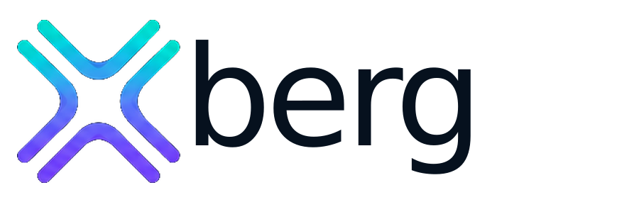

<p align="center">
  <picture>
    <source media="(prefers-color-scheme: dark)" srcset="banner/readme-banner-dark.svg">
    
  </picture>
</p>

# Xberg brand assets

Canonical brand assets for [Xberg](https://xberg.io) and all `xberg-io` projects. Single source of
truth — reference these across READMEs, docs sites, and social channels.

## CDN usage (READMEs, anywhere needing an absolute URL)

Per-package READMEs publish to npm/PyPI/crates, which do not resolve relative repo paths — use the
jsdelivr CDN, pinned to a tag:

```text
https://cdn.jsdelivr.net/gh/xberg-io/assets@v1/<path>
```

Top-of-README banner (auto dark/light):

```html
<p align="center">
  <picture>
    <source media="(prefers-color-scheme: dark)"
            srcset="https://cdn.jsdelivr.net/gh/xberg-io/assets@v1/banner/readme-banner-dark.svg">
    
  </picture>
</p>
```

## Layout

- `banner/` — README hero banner, light + dark (navbar wordmark, 900×285).
- `logo/` — `wordmark-*` and `symbol-*` (rotated junction), each `light` / `dark` / `mono-black` / `mono-white`.
- `favicon/` — full suite (`favicon.ico`, 16–512 PNG, apple-touch-icon, android-chrome, `site.webmanifest`).
- `social/` — `open-graph-card.png` (1200×630), `github-avatar-512.png`, `x-twitter-header.png`, `linkedin-banner.png`.
- `docs/` — `navbar-logo-{light,dark}.svg`, `footer-logo-{light,dark}.svg`, `docs-logo.svg`, `app-icon.svg`, `hero-logo.svg`, `loading-mark.svg`.
- `color_tokens.{css,json}`, `logo_usage_rules.md` — palette + usage guidance.

Updating: change a file, bump the tag (`v2`, …), update the `@v1` pin in consumers. Older tags stay
served by jsdelivr for cache stability.

## License

MIT © Kreuzberg, Inc. See [LICENSE](LICENSE).
